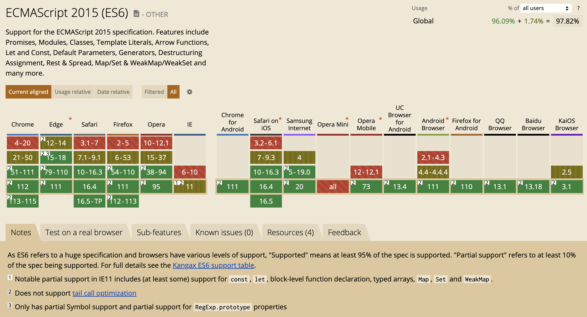

# introduction


## structure
```txt
.
├── celerity-app
│   └── celerity-app-main
│
├── celerity-common
│
├── celerity-core
│   ├── celerity-core-auth
│   ├── celerity-core-develop
│   ├── celerity-core-system
│   └── celerity-core-user
│
├── celerity-message
│   ├── celerity-message-kafka
│   └── celerity-message-rabbitmq
│
├── celerity-module
│   ├── celerity-module-test
│   └── celerity-module-demo
│
├── celerity-storage
│   ├── celerity-storage-clickhouse
│   ├── celerity-storage-couchbase
│   ├── celerity-storage-minio
│   ├── celerity-storage-mongodb
│   ├── celerity-storage-mysql
│   └── celerity-storage-redis
│
├── celerity-ui
│   ├── apps
│   ├── modules
│   ├── packages
│   └── tools
│
├── index.md
└── README.md
```

## Support


## Dep
### Frontend
+ [Vue](https://cn.vuejs.org/)
+ [Vue Router](https://router.vuejs.org/zh/)
+ [Pinia](https://pinia.vuejs.org/zh/)
+ [Ant Design of Vue](https://antdv.com/)
+ [Surely Vue](https://surely.cool/)

### Backend

### Doc
+ [VitePress](https://vitepress.dev/)

